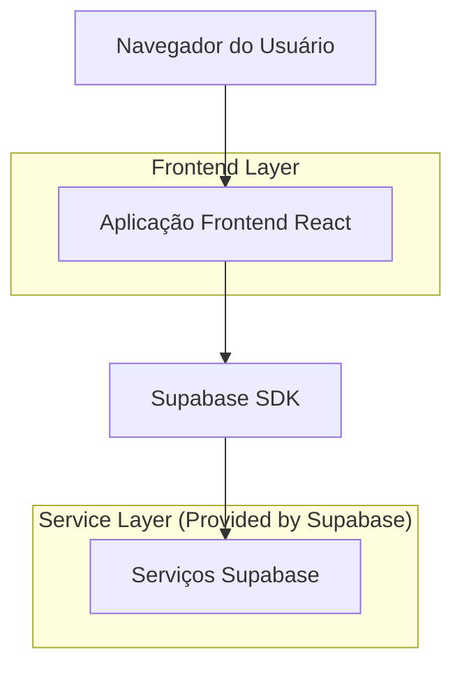
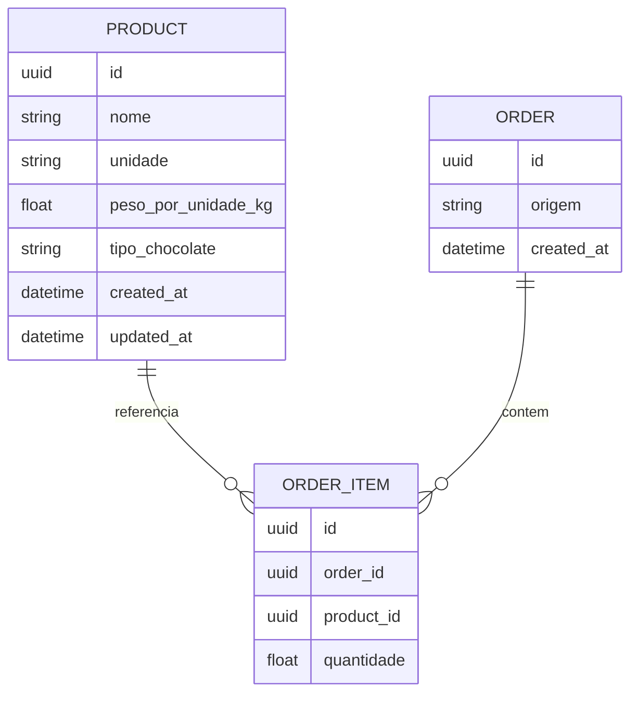

## 1.Architecture design


## 2.Technology Description
- Frontend: React@18 + vite + tailwindcss@3
- Backend: Supabase (Auth opcional) + Supabase Postgres

## 3.Route definitions
| Route | Purpose |
|-------|---------|
| /produtos | Cadastro e manutenção de produtos (unidade e tipo de chocolate) |
| /loja | Interface da loja para criar pedido e ver totais |
| /fabrica | Interface da fábrica para importar texto e ver totais |

## 6.Data model(if applicable)

### 6.1 Data model definition


### 6.2 Data Definition Language
Product Table (products)
```
CREATE TABLE products (
  id UUID PRIMARY KEY DEFAULT gen_random_uuid(),
  nome TEXT NOT NULL,
  unidade TEXT NOT NULL,
  peso_por_unidade_kg DOUBLE PRECISION NULL,
  tipo_chocolate TEXT NOT NULL,
  created_at TIMESTAMPTZ NOT NULL DEFAULT NOW(),
  updated_at TIMESTAMPTZ NOT NULL DEFAULT NOW()
);

CREATE UNIQUE INDEX products_nome_unique_ci ON products (lower(nome));

GRANT SELECT ON products TO anon;
GRANT ALL PRIVILEGES ON products TO authenticated;
```

Order Table (orders)
```
CREATE TABLE orders (
  id UUID PRIMARY KEY DEFAULT gen_random_uuid(),
  origem TEXT NOT NULL, -- 'loja' ou 'fabrica'
  created_at TIMESTAMPTZ NOT NULL DEFAULT NOW()
);

GRANT SELECT ON orders TO anon;
GRANT ALL PRIVILEGES ON orders TO authenticated;
```

Order Items Table (order_items)
```
CREATE TABLE order_items (
  id UUID PRIMARY KEY DEFAULT gen_random_uuid(),
  order_id UUID NOT NULL,
  product_id UUID NOT NULL,
  quantidade DOUBLE PRECISION NOT NULL
);

CREATE INDEX order_items_order_id_idx ON order_items(order_id);
CREATE INDEX order_items_product_id_idx ON order_items(product_id);

GRANT SELECT ON order_items TO anon;
GRANT ALL PRIVILEGES ON order_items TO authenticated;
```
