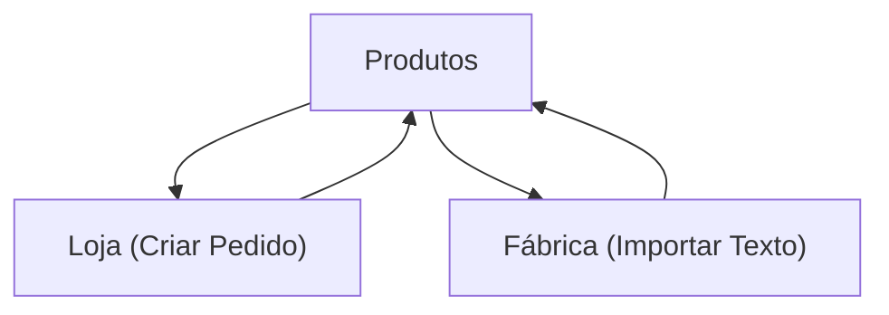

## 1. Product Overview
Aplicação web para automatizar a consolidação de pedidos entre loja e fábrica.
Permite cadastrar produtos (unidade e tipo de chocolate), criar/importar pedidos e calcular totais (sacos, kg e kg por tipo).

## 2. Core Features

### 2.1 User Roles
| Papel | Método de acesso | Permissões principais |
|------|-------------------|-----------------------|
| Loja | Acesso interno (sem cadastro obrigatório) | Cadastrar/editar produtos; criar pedido; visualizar totais |
| Fábrica | Acesso interno (sem cadastro obrigatório) | Importar pedido via texto; visualizar totais |

### 2.2 Feature Module
Nossa solução consiste nas seguintes páginas principais:
1. **Produtos**: cadastro/edição de produtos (unidade, peso por unidade quando aplicável, tipo de chocolate).
2. **Loja (Criar Pedido)**: montar pedido selecionando produtos e quantidades; gerar totais.
3. **Fábrica (Importar Texto)**: colar/importar texto do pedido; validar itens; gerar totais.

### 2.3 Page Details
| Page Name | Module Name | Feature description |
|-----------|-------------|---------------------|
| Produtos | Lista de produtos | Exibir produtos cadastrados com busca simples por nome. |
| Produtos | Cadastro/Edição | Criar/editar produto com: nome; unidade (ex.: saco, kg, unidade); peso por unidade (kg) quando unidade ≠ kg; tipo de chocolate. |
| Produtos | Regras de validação | Validar campos obrigatórios; impedir nome duplicado (case-insensitive). |
| Loja (Criar Pedido) | Montagem do pedido | Adicionar/remover itens; selecionar produto; informar quantidade; ajustar quantidade. |
| Loja (Criar Pedido) | Totais do pedido | Calcular e exibir: total de sacos; total de kg; kg por tipo de chocolate. |
| Loja (Criar Pedido) | Revisão | Mostrar lista final de itens e permitir correções antes de finalizar a visualização. |
| Fábrica (Importar Texto) | Entrada de texto | Permitir colar texto bruto do pedido (uma linha por item). |
| Fábrica (Importar Texto) | Parser/Validação | Interpretar cada linha em (produto, quantidade); sinalizar linhas inválidas e produtos não encontrados. |
| Fábrica (Importar Texto) | Totais do pedido | Calcular e exibir: total de sacos; total de kg; kg por tipo de chocolate. |

## 3. Core Process
**Fluxo Loja**
1) Você cadastra/atualiza os produtos (unidade, peso por unidade quando aplicável, tipo de chocolate).
2) Você monta um pedido adicionando itens e quantidades.
3) Você visualiza automaticamente os totais: sacos, kg e kg por tipo de chocolate.

**Fluxo Fábrica**
1) Você cola/importa o texto do pedido.
2) O sistema valida linhas e tenta associar produtos cadastrados.
3) Você visualiza os totais: sacos, kg e kg por tipo de chocolate.

